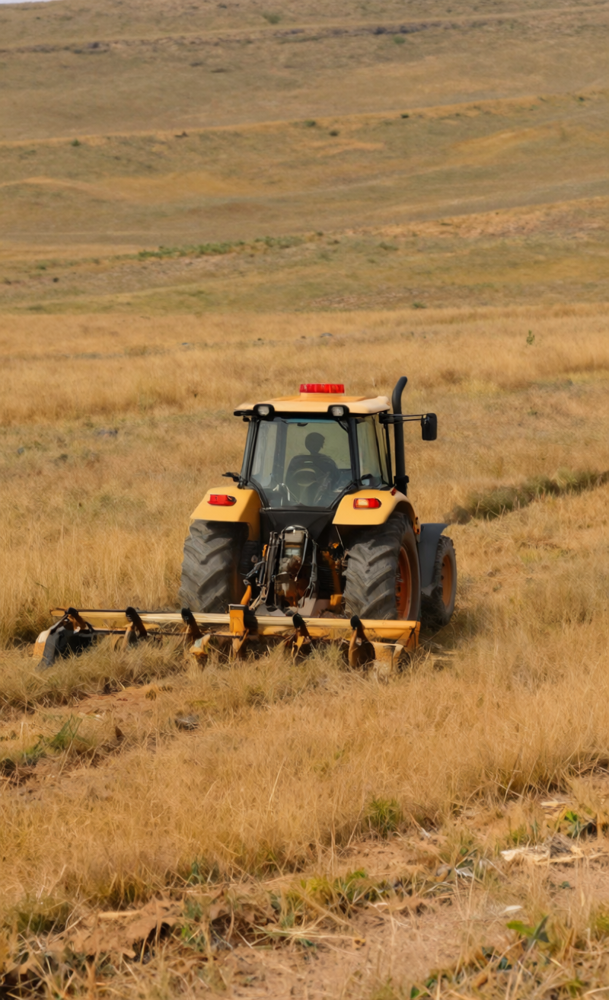

# Qwen Image 2.1 Fun ControlNet Union for ComfyUI

**English** | [简体中文](README_CN.md)

Native ComfyUI nodes for [Alibaba PAI's Qwen Image 2.1 Fun ControlNet Union](https://huggingface.co/alibaba-pai/Qwen-Image-2.1-Fun-Controlnet-Union). One Union checkpoint supports Canny, Depth, Grayscale, HED, Lineart, MLSD, Pose, Scribble, and masked inpainting. The nodes use ComfyUI's native Qwen Image 2.1 model and conditioning pipeline.

## Requirements

- A ComfyUI build with native Qwen Image 2.1 Fun support ([upstream PR #16519](https://github.com/Comfy-Org/ComfyUI/pull/16519), or a release containing it).
- The [Comfy-Org Qwen Image 2.1 base models](https://huggingface.co/Comfy-Org/Qwen-Image-2.1).
- The [converted Union checkpoint](https://huggingface.co/t8star/Qwen-Image-2.1-Fun-Controlnet-Union-Comfy).

Place the files in these **ComfyUI** directories:

| File | Directory |
| --- | --- |
| `Qwen-Image-2.1-Fun-Controlnet-Union-ComfyUI.safetensors` | `models/controlnet/` |
| `qwen_image_2.1_int8_convrot.safetensors` | `models/diffusion_models/` |
| `qwen3vl_8b_int8_convrot.safetensors` | `models/text_encoders/` |
| `qwen_image_2.1_vae_bf16.safetensors` | `models/vae/` |

## Install and use

Install **Qwen Image 2.1 Fun ControlNet Union (T8)** from ComfyUI Manager, or clone this repository into `ComfyUI/custom_nodes/`. Restart ComfyUI.

Copy the sample files from [`assets/`](assets) to `ComfyUI/input/`, then drag a UI workflow from [`workflows/`](workflows) onto the canvas. The eight control workflows and the pose plus inpaint workflow are ready to run after the models are placed. Files ending in `.api.json` are API prompts, not canvas workflows.

Connect a **prepared** Canny, Depth, Grayscale, HED, Lineart, MLSD, Pose, or Scribble map to **Apply Qwen Image 2.1 UNION**. The mode selector describes the map; it does not preprocess a photograph. For inpainting, connect the source image and a mask where **white is regenerated**. **Qwen 2.1 Latent From Control Image** keeps the input aspect ratio. The native `TextEncodeQwenImage21` node can also accept image references.

Each connected condition input (control image, inpaint image, or mask) must contain one image; the native patch otherwise uses only the first item of each batch. To sample multiple seeds from the same control, repeat the latent after the aspect-ratio node. Extremely wide or tall inputs that would produce an output side above 4096 pixels are rejected; reduce resolution or crop/pad the input.

The loader validates the 16-block Union checkpoint. All eight map workflows and the inpaint workflow were run successfully; the pictured Canny result used the default 40 steps at 800×1312 output.

## License and provenance

Node code: [MIT](LICENSE). Model weights: [Qwen Research License](MODEL_LICENSE.txt), **non-commercial use only** unless separately licensed by Qwen. The converted checkpoint preserves all tensor names, shapes, offsets, and payload bytes; only safetensors header metadata changes. Checksums are in [`MODEL_SHA256.json`](MODEL_SHA256.json), and the conversion script is [`convert_union.py`](convert_union.py).

## T8 links

[Bilibili](https://space.bilibili.com/385085361) · [YouTube](https://www.youtube.com/@T8star-Aix/) · [API](https://api.seedance.nz/sign-up?aff=5f4w) · [Free gallery](https://www.openzhenzhen.com) · [Online AI apps](https://www.runninghub.ai/zh-cn/user-center/1907375370302308353/userPost?inviteCode=rh-v1121) · [ComfyUI bundle](https://pan.quark.cn/s/264edb7e36bd) · [Hugging Face](https://huggingface.co/t8star)
